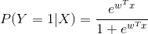
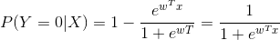
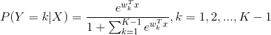
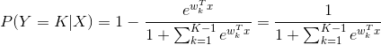
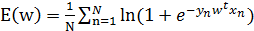
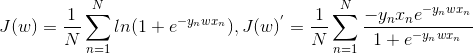

# 作业

---

## 1.调研使用逻辑回归进行多元（3元及以上）分类的思路，基本的思路描述和应用场景

>   回顾二元分类：
    
>    
    
>    
>    

 
- 可推广到多元分类：
 
    
    

    

- 或者使用两次多元分类

损失信息？

## 2.已知样本内误差为：，w为参数，x属于[-∞,+∞]，y in (0,1)，N为数据集包含记录数。使用第一堂课讲的梯度下降法，推导出求解方法，并写出伪代码；（下堂课黑板上做）



```python
import math
def derivative(x,y,w):
    return -1*y*x/(1+math.exp(-1*y*w*x))

w = 1
alpha = 0.01    
for i in range(200):
    sum = 0
    for j in range(1,N+1):
        sum += derivative(x[j],y[j],w)
    w = w - alpha / N * sum
```

## 3.	查询Xlib中分类评估各个指标（kappa statistic, TP rate, FP rate, F-measure等）的公式、意义、作用

        TP Rate ：true positive rate，TPR简称“真正率” ，即被模型预测为正的正样本比率。TPR = TP /（TP + FN） 正样本预测结果数 / 正样本实际数。以体育类为例，TPR=93/100= 0.93.

        FP Rate：false positive rate， FPR简称“假正率” ，即被模型预测为正的负样本比率。 FPR = FP /（FP + TN） 被预测为正的负样本结果数 /负样本实际数。以体育类为例，FPR=1/600= 0.0017≈0.002。

        Precision：精确度，即被模型正确预测的样本与所有被预测为正的样本的比率。以体育类为例，被模型正确预测的样本数 = 93,所有被预测为正的样本为94，所以Precision=93/94=0.98936≈0.989.

        Recall：召回率，即所有该类样本被正确预测的比例。  以体育类为例，总样本数为100，正确预测93个，召回率=0.93.

        F-Measure：在weka中F-Measure被定义为（2*Precision*Recall）/(Precision*Recall).  以体育类为例，F-Measure=(2*0.989*0.93)/(0.989+0.93)=1.84/1.92=0.958.

        ROC Area：ROC曲线下的面积，即Area Under roc Curve(AUC)。这个指标来自医学AUC值介于0.5到1之间，值越大表示分类器越好。该指标与Wilcoxon-Mann-Whitney test 统计指标等价。参见：http://longmans1985.blog.163.com/blog/static/7060547520128194220344/

## 4.调研混淆矩阵在分类效果评估中的应用，这个课上没有讨论，大家可以查阅一下基本理论、应用方式

http://cos.name/2008/12/measure-classification-model-performance-confusion-matrix/


---

P(Y=1|X)=1-\frac{e^{w_k^{T}x}}{1+\sum_{k=1}^{K-1}e^{w_k^{T}x}}=\frac{1}{1+\sum_{k=1}^{K-1}e^{w_k^{T}x}}